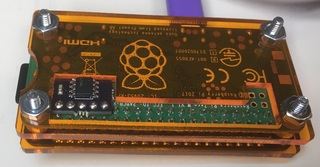
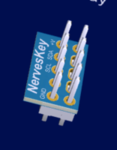

# Hardware

The Nerves Key is a provisioned ATECC508A or ATECC608A. Both chips are
relatively inexpensive additions to devices that attach to an I2C bus. This
directory contains circuit board designs to add an ATECC508A/608A to Raspberry
Pis.

## 5-pin bottom solderable module

The `proto4` directory is a hand solderable module that can be mounted
underneath the Raspberry Pi or connected "upside down" to the top.

Parts:

* [PCB from OSHPark](https://oshpark.com/shared_projects/A2rzFSK7)
* [ATECC608A-SSHDA](https://www.digikey.com/product-detail/en/microchip-technology/ATECC608A-SSHDA-B/ATECC608A-SSHDA-B-ND/7928178)
* [0.1 uF 0603 capacitor](https://www.digikey.com/product-detail/en/samsung-electro-mechanics/CL10F104ZO8NNNC/1276-1258-1-ND/3889344)

See the [proto4](proto4) directory for Eagle files.

## Nerves Key shim

 

We're working on a "shim" version that slides onto the Raspberry Pi's GPIO
header and can fit in between the Pi and a hat. No soldering required and it
is very small. For a permanent connection, it can be soldered down like the
version above.

* [Schematics](shim/MCM18001_NERVESKEY_X1_SCH_181214.PDF)

See the [shim](shim) directory for files.
