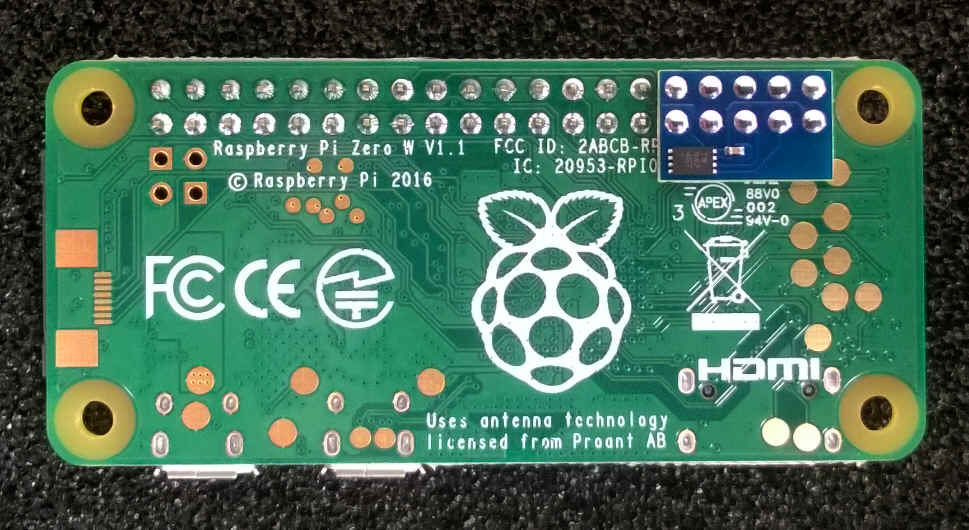

# Hardware

The NervesKey is a tiny circuit board with an ATECC608A cryptographic chip from
[Microchip Technology](https://www.microchip.com/). It is an inexpensive
addition to the Raspberry Pi and other embedded computing platforms that include
an I2C bus.

The production NervesKey board contains the tiny 'UDFN' version of the part
[ATECC608A-MAHDA](https://www.digikey.com/product-detail/en/microchip-technology/ATECC608A-MAHDA-S/ATECC608A-MAHDA-STR-ND/7928113)
and a 0.1uF 0402 size capacitor.  These boards are not easily assembled, so they
are professionally manufactured in high quantity for the Nerves project and
offered for sale at [Tindie /
NervesKey](https://www.tindie.com/products/troodonsw/nerveskey/).

## Mounting to a Raspberry Pi

The easiest way to outfit a Raspberry Pi with a NervesKey is to solder it to the
'hat' expansion header on the bottom of the board as shown below.  This will
connect the appropriate signals and keep the board out of the way of other uses
of the hat header.  The NervesKey board is thin to support this application.

## Schematics

See the [schematic](assets/TSW19001_NERVESKEY_X1_SCH.PDF) for additional
hardware details, notes, and examples.

## Links

* [Microchip's ATECC508A](https://www.microchip.com/wwwproducts/en/ATECC508A)
  website
* [Microchip's ATECC608A](https://www.microchip.com/wwwproducts/en/ATECC608A)
  website
* [cryptoauthlib](https://github.com/MicrochipTech/cryptoauthlib) - a different,
  but official C library for the ATECC508A/608A
